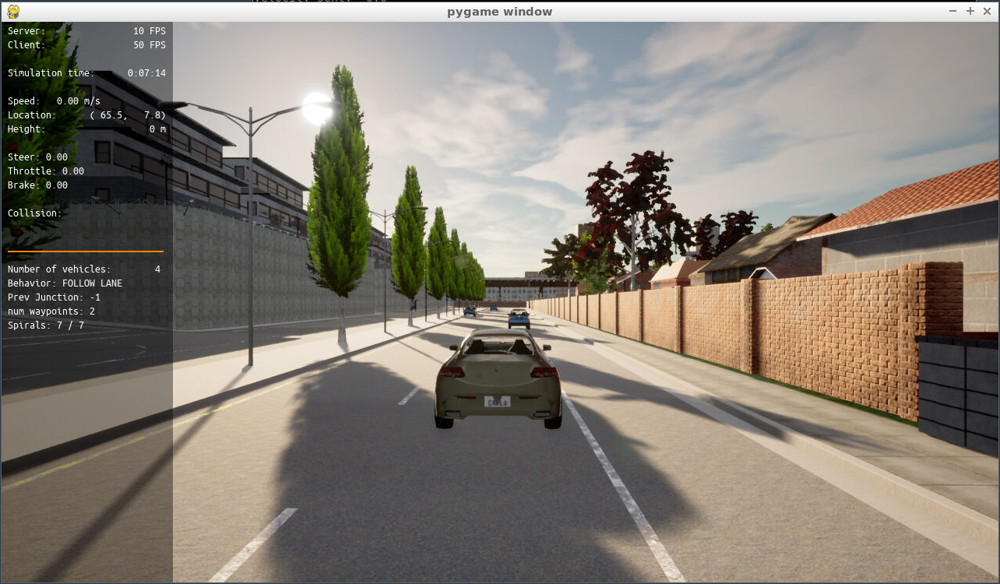
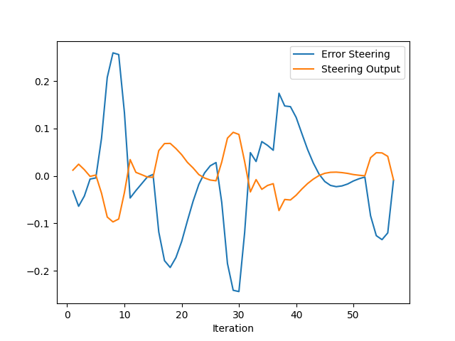
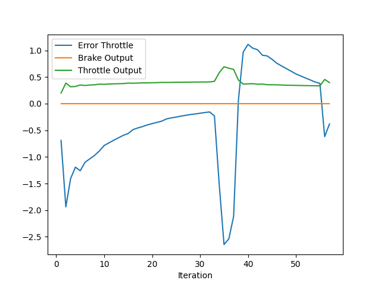
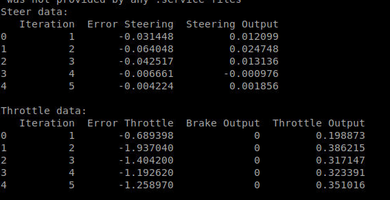

# Control and Trajectory Tracking for Autonomous Vehicle

# Proportional-Integral-Derivative (PID)

In this project, you will apply the skills you have acquired in this course to design a PID controller to perform vehicle trajectory tracking. Given a trajectory as an array of locations, and a simulation environment, you will design and code a PID controller and test its efficiency on the CARLA simulator used in the industry.

## Step 1: Build the PID controller object
The screenshot is shown as follows. The car does not move in the simulation.

## Step 2 & 3: PID controller for throttle and steer
Tuned the parameters of the pid many times but cannot get a perfect trajectory. The best result I have got is set by the following parameters
| P_STEER | I_STEER | D_STEER | P_THROTTLE | I_THROTTLE | D_THROTTLE |
|:--------:|:--------:|:--------:|:-----------:|:-----------:|:-----------:|
|   0.35    |   0.002    |   0.11    |     0.08     |     0.01     |     0.35     |

## Questions

## Add the plots to your report and explain them (describe what you see)

As it can be seen in the graphs and the table, both the error from the throttle and error from the steering is being corrected during iterations. But the steering controller seems to produce lots of overshooting.

## What is the effect of the PID according to the plots, how each part of the PID affects the control command?

- P ---> **Proportional**: Produces an output value that is proportional to the current error value. A high proportional gain results in a large change in the output for a given change in the error.

- I ---> **Integral**: Proportional to both the magnitude of the error and the duration of the error. The integral term accelerates the movement of the process towards setpoint and eliminates the residual steady-state error that occurs with a pure proportional controller.

- D ---> **Derivative**: calculated by determining the slope of the error over time and multiplying this rate of change by the derivative gain. Derivative action predicts system behavior and thus improves settling time and stability of the system.

## How would you design a way to automatically tune the PID parameters?

As learned in the course, I would use "Twiddle" to find the coefficients which best minimize the cross-track error for PID controller.

## PID controller is a model free controller, i.e. it does not use a model of the car. Could you explain the pros and cons of this type of controller?
### Pros:
- It is a simple algorithm to implement and compute.
- It can run in real-time speed.
- It can be a solution if a domain model is hard to built.

### Cons:
- Does not perform well compared to the model-based method in some scenarios
- Might be time-consuming to tune the parameters.

## (Optional) What would you do to improve the PID controller?
- One of the improvements is to consider more facts for steering control. For example, the perpendicular deviation from the desired trajectory.
- Another improvement is to fine-tune the parameters with Twiddle.
